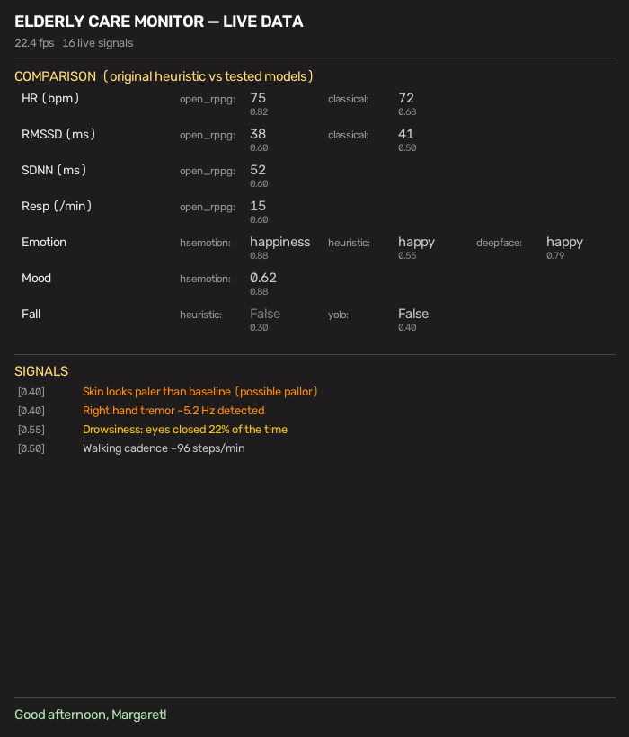

# Humanoid Camera — Elderly Care Detection Pipeline

A modular computer-vision pipeline that watches live camera footage and detects
health, safety, and emotional signals to power **customized greetings and
recommendations** for elderly people living alone.

It implements every item in [detectionList.md](detectionList.md) as an
independent, hot-swappable module. See [docs/RESEARCH.md](docs/RESEARCH.md) for
the method and feasibility rating behind each one.

> ⚠️ **Not a medical device.** All health signals are screening prompts to
> trigger a gentle check-in or caregiver alert — never diagnoses.

## Quick start
```bash
pip install -r requirements.txt
pip install -r requirements-openrppg.txt   # optional: neural rPPG backend
# MediaPipe .task models are downloaded into models/ (see docs/RESEARCH.md)
python main.py                       # default webcam; Camera + Data windows
python main.py --source clip.mp4     # run on a video file
python main.py --combined            # old single-window overlay instead
python main.py --headless --name Margaret   # no window; prints greetings/alerts
```
Windowed controls: `q` quit · `g` force a greeting.

By default two windows open: **Camera** (video + face/pose boxes only) and
**Detections — Data**, a readable dashboard with all signals. The vitals
section shows both heart-rate backends side by side:



### Heart rate: two backends, compared live
The `heart_rate` module runs one or more rPPG backends and reports each one's
numbers so you can compare them:
- **classical** — forehead green-channel bandpass + FFT (numpy/scipy only).
- **open-rppg** — neural models ([KegangWangCCNU/open-rppg](https://github.com/KegangWangCCNU/open-rppg),
  JAX); gives HR, RMSSD, SDNN, and breathing rate. Auto-disables if not installed.

Select in `config/modules.yaml`:
```yaml
heart_rate:
  backends: [classical, openrppg]   # drop openrppg to run classical only
  openrppg_model: null              # null = default; try physformer or efficientphys
```
open-rppg loads its model once (~15–20s) at startup, then runs batched
inference on a rolling buffer of face crops. Live inference runs in a background
thread so CPU-only Open-RPPG does not freeze camera frames; by default it updates
about every 5 seconds from the same 30-second signal window.
The backend sets `KERAS_BACKEND=jax` before importing Open-RPPG to avoid
TensorFlow/JAX tensor mismatches. On startup it logs the selected model,
dependency versions, and JAX devices so you can confirm whether the A2000 GPU is
being used. If JAX only prints `cpu:0`, install a CUDA-enabled JAX wheel; on
Windows this is most reliable inside WSL2/Linux.
The dashboard always shows Open-RPPG rows for HR, RMSSD, SDNN, respiration, and
status; unavailable metrics display `...` until enough clean signal is available.
The terminal also prints periodic vitals summaries; tune with
`--vitals-log-every` or disable with `--vitals-log-every 0`.

For accuracy testing, record the same clean clip while wearing a pulse oximeter,
watch, or chest strap, then benchmark candidate models:
```bash
python tests/benchmark_rppg_models.py --source clip.mp4 --reference-bpm 72 \
  --models default physformer efficientphys --csv rppg_benchmark.csv
```
Pick the model with the lowest MAE, acceptable confidence coverage, and usable
latency. HRV and BVP-derived breathing are only emitted after a longer clean
window, and may show lower confidence, because they are less reliable than HR
from webcam video.

DeepFace emotion runs in a separate TensorFlow subprocess so it can coexist with
Open-RPPG's required JAX backend in the main process.

## Architecture
```
Camera ─▶ Extractors ─▶ Scheduler(modules) ─▶ Aggregator ─▶ Greeting / Overlay
          (face, pose,     runs each module      latest signal
           motion — once   at its own cadence    per (module,key)
           per frame)      when inputs present
```
- **`core/`** — camera, per-frame `FrameContext`, `Result` schema, module
  registry, cadence-aware scheduler, pipeline orchestrator.
- **`extractors/`** — expensive shared steps (MediaPipe FaceLandmarker /
  PoseLandmarker / motion) run **once** per frame and cached in the context.
- **`modules/`** — one file per detection; each is a `DetectionModule` that
  reads the context and returns `Result`s. Self-registered via `@register`.
- **`output/`** — aggregator, rule-based greeting engine, debug overlay.
- **`storage/`** — SQLite history for longitudinal signals (activity, presence).
- **`config/modules.yaml`** — enable/disable and tune every module.

## Add or change a module
1. Drop `modules/my_thing.py`:
   ```python
   from core.registry import register
   from modules.base import DetectionModule

   @register("my_thing")
   class MyThing(DetectionModule):
       interval = 1.0            # run at most once a second
       requires = ("face",)      # skipped when no face in frame

       def process(self, ctx):
           return self.result("my_key", value=..., message="...")
   ```
2. Add `my_thing: { enabled: true }` to `config/modules.yaml`.

No edits to the pipeline, scheduler, or output layer are ever needed — that's
the point of the design.

## Test without a webcam
```bash
python tests/smoke_test.py          # full pipeline on synthetic frames
python tests/make_clip.py           # write a synthetic video
python main.py --source tests/synthetic_clip.mp4 --headless --max-frames 80
```

## Module catalogue (30)
Vitals: `heart_rate` (+HRV), `respiration`.
Skin/face: `skin_color` (pallor/flushing/cyanosis/jaundice), `rash`, `bruise`,
`eye_redness`, `sweating`, `dry_lips`, `facial_asymmetry`, `facial_swelling`.
Motor/neuro: `tremor`, `gait`, `balance`, `bradykinesia`, `masked_face`,
`eye_movement`.
Fatigue/safety: `drowsiness` (PERCLOS/blink/microsleep), `yawn`, `head_nod`,
`fall`, `unresponsive`, `wandering`, `hazard_zones`.
Emotion/cognition: `emotion`, `pain`, `agitation`.
Behavior/demographic: `activity_level`, `presence`, `age_estimation`,
`body_estimate`.

## Privacy note
Designed to run fully on-device. The SQLite store keeps only numeric signal
summaries, not video. If you add cloud features, get informed consent — this is
sensitive health data about a vulnerable person.
