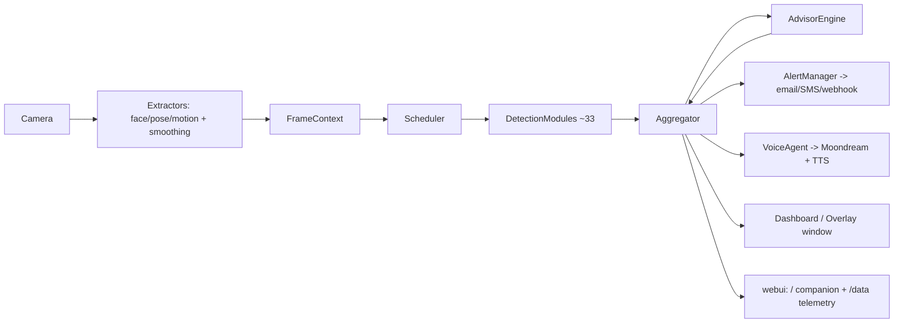

# Architecture

A humanoid-camera system for an elderly person living alone: it watches live
video, runs ~33 detection modules, and turns the results into a spoken companion
(voice agent), caregiver alerts, an on-screen dashboard, and a web view. This
doc explains how the pieces fit together. To *extend* it, see
[EXTENDING.md](EXTENDING.md).

> **Safety principle.** Health signals are *screening prompts*, never diagnoses.
> The **caregiver-alert path is deterministic** (`alerts/`) and never depends on
> the LLM; the **voice agent** (`agent/`) only produces friendly conversation.

## Data flow

```
                 config/modules.yaml (+ alerts.yaml, .env)
                              │  enables & tunes
                              ▼
 Camera ─frames→ Extractors ─fill→ FrameContext ─→ Scheduler ─→ DetectionModules
 (core/camera)   face/pose/motion  (core/context)  (core/       (modules/*, each
                 + One-Euro smooth                  scheduler)    emits Result[s])
                                                                     │
                                                                     ▼
                                              Aggregator (latest per key + median)
                                                (output/aggregator)
                                                                     │ snapshot()
                            ┌────────────────────────┬───────────────┼───────────────┐
                            ▼                        ▼               ▼               ▼
                     AdvisorEngine            AlertManager      VoiceAgent      Dashboard/Overlay
                     (agent/advisor_engine)   (alerts/)         (agent/)        (output/) + webui
                     post-hoc advice →         deterministic     Moondream speech window + /data
                     back into Aggregator      notifications     + TTS
```

Per frame (`core/pipeline.py: Pipeline.process_frame`): run each extractor,
run due modules via the scheduler, ingest their `Result`s into the aggregator,
then run the advisor over the snapshot and ingest its advice too. `main.py`'s
`on_frame` then drives alerting, the voice agent, the window, and the web UI.



## Core abstractions

| Concept | File | What it is |
|---|---|---|
| `Result`, `Severity` | `core/events.py` | The one value every module emits: `(module, key, value, confidence, severity, message, ttl)`. Severity (INFO/NOTICE/WARNING/ALERT) drives alerting and greeting. |
| `FrameContext`, `FaceData`, `PoseData` | `core/context.py` | Per-frame shared state. Extractors fill `ctx.face`/`ctx.pose`/`ctx.motion_energy`; modules read them. `ctx.extras` is a scratch dict for cross-module data (e.g. `clothing`, `weather`). |
| `@register` + `discover` | `core/registry.py` | Modules self-register by name; `discover("modules")` imports them so the decorator runs. `build_enabled(config)` instantiates the enabled ones. |
| `DetectionModule` | `modules/base.py` | Base class. Declares `interval` (min seconds between runs) and `requires` (`"face"`/`"pose"`/`"person"`); implements `process(ctx) -> Result(s)`; `self.result(...)` builds a Result. |
| `Scheduler` | `core/scheduler.py` | Runs each module only when its `interval` elapsed **and** its `requires` inputs are present — so a slow module can't run every frame and modules never see missing inputs. |
| `Backend` | `modules/backends/base.py` | Multi-backend pattern: a detector can run several implementations (heuristic + tested models) at once and show each result side by side. `update(ctx)` per frame, `compute() -> dict`. |
| `Aggregator` | `output/aggregator.py` | Keeps the latest non-expired Result per `(module, key)`; smooths numeric values with a rolling median. `snapshot()` is the single "person state" everything downstream reads. |
| `AdvisorEngine` | `agent/advisor_engine.py` | Post-aggregation rules (e.g. vitals → gentle advice) that emit more Results back into the aggregator. |

The most-connected "god nodes" (per the graphify graph) are `FrameContext`,
`Severity`, `DetectionModule`, `TimedBuffer` (`modules/_util.py`), `register`,
`Result`, `Scheduler`, and `Aggregator` — start there when learning the code.

## Threading model (important)

The video loop in `main.py` must never block. Heavy work runs off it:
- **Three-resolution pipeline** — capture and the bounded vitals-sampler retain
  the original frame. Authoritative face detection defaults to 640 px; pose and
  passive detectors receive a synchronized context
  capped at the configured analysis width, with nearest-neighbor depth and scaled
  pixel intrinsics/bounding boxes. Normalized landmarks remain unchanged.
- **Capture-safe vitals lane** — camera readers only enqueue a frame reference and
  timestamp. A dedicated sampler drops the oldest of at most two pending frames,
  seeds optical flow from authoritative face anchors, and performs rPPG updates.
  Physical capture, sampler rate/drops, and fast-hook p50/p95/max are independent
  private diagnostics.
- **Adaptive background lane** — only the latest frame is queued. Sustained
  overload increases passive-module intervals with recovery hysteresis; safety,
  vitals, and active guided assessments are exempt. Advisor evaluation uses its
  own one-flight worker so history queries cannot stall detectors.
- **Quality-first workload budget** — maximum-quality analysis retains native
  capture ROIs and rotates due passive modules across bounded sweeps. Cadence is
  shed before spatial detail; safety and active elicitation are budget-exempt.
- **Native detail contexts** — normalized face/pose geometry from bounded
  inference frames addresses the original capture. Face skin masks and LAB/HSV/
  grayscale planes are cached once per native ROI, and aligned depth/intrinsics
  remain available for metric arm findings.
- **Async inference workers** — `rppg_backends/openrppg.py` (JAX) and
  `modules/clothing.py` (FashionCLIP/OWLv2) run inference on a
  `ThreadPoolExecutor` and cache the last reading via a `_pending` future; the
  DeepFace emotion backend runs in a subprocess. `compute()`/`process()` return
  the cached value immediately and pick up the result when the future is done.
- **Cloud isolation** — Moondream generation uses the documented
  `X-Moondream-Auth` header
  from a one-flight worker. The voice agent polls without blocking and speaks a
  reviewed template after a short deadline. Authorization failures (401/403) latch
  until an explicit off/on toggle; transient failures use bounded backoff. NVIDIA skin analysis validates strict
  JSON, retries one schema repair, and never exposes raw provider content.
- **Latest-only authority workers** — authoritative face extraction and passive
  detector analysis consume bounded latest-frame slots. Face inference adapts
  from 640 to 480 pixels only during sustained overload, while full capture
  pixels remain available to rPPG. Classical heart calculations run one-flight
  and the critical scheduler only publishes newly completed readings.
- **Intentional coalescing** — a busy background lane skips redundant incoming
  frames instead of replacing a queued frame. Diagnostics distinguish these
  cadence skips from true queue drops. Numeric history writes use a bounded
  daemon writer and expose queue/failure health.
- **Asynchronous longitudinal aggregates** — detector callbacks append samples
  and read in-memory rolling snapshots only. A separate SQLite read connection
  bootstraps registered windows; portal/export/retention queries never execute
  on camera, sampler, geometry, or detector threads.
- **Native runtime governance** — process-local OpenCV, TensorFlow, Torch and
  BLAS pools are bounded before import. The JAX rPPG worker retains its separate
  CPU affinity, and FashionCLIP explicitly owns CUDA in the parent process.
- **Native ASR isolation on Windows** — microphone/VAD/history remain in the
  parent, while Faster-Whisper and CTranslate2 load only in a spawned CPU worker,
  preventing their native DLLs from colliding with CUDA PyTorch/FashionCLIP. A
  worker-local import blocker disables CTranslate2's optional Torch probe; private
  diagnostics expose only the worker PID and boolean runtime inventory, never DLL paths.
- **Web server** — `webui/server.py` is a `ThreadingHTTPServer` on a daemon
  thread; `publish`/`publish_data` push to thread-safe buses read by SSE clients.
- **Text-to-speech** — `audio/tts.py` speaks on its own worker thread so
  `Speaker.say()` never blocks.

## Package map

| Package | Role |
|---|---|
| `core/` | Camera, `FrameContext`, `Result`/`Severity`, registry, scheduler, pipeline, debug log. |
| `extractors/` | Run once per frame: MediaPipe face + pose, motion energy, One-Euro landmark smoothing; landmark-index tables. |
| `modules/` | The ~33 detectors. `modules/_util.py` = shared signal helpers (`TimedBuffer`, `bandpass`, FFT). |
| `modules/backends/`, `modules/rppg_backends/`, `modules/emotion_backends/` | Multi-backend implementations (heuristic + tested models) shown side by side. |
| `output/` | `aggregator` (person state), `dashboard` (window + `to_payload` for `/data`), `overlay`, legacy `greeting_engine`. |
| `agent/` | The Moondream voice agent: `state` (memory), `policy` (what to say), `moondream_client`, `voice_agent`, `advisor_engine`, `env`. |
| `alerts/` | Deterministic caregiver alerting: `notifier` (channels), `manager` (confirm/dedupe/escalate). |
| `audio/` | Offline text-to-speech. |
| `webui/` | Stdlib web server: `/` companion text + `/data` full telemetry (SSE), pages `page.html` / `data.html`. |
| `storage/` | SQLite store for longitudinal samples/baselines. |
| `tests/` | Camera-free smoke + focused tests. |

## Entry points & config

- **Run:** `python main.py` (see README for flags: `--webui`, `--no-voice`,
  `--source`, `--headless`, `--debug-modules`, …).
- **Autonomous development:** `python dev.py` runs a hardware-free replay under
  a process-level hot-reload supervisor. Supervisor and child stdout share one
  terminal; the private live acceptance endpoint is
  `http://127.0.0.1:8771/debug/state`. See
  [AI_DEVELOPMENT.md](AI_DEVELOPMENT.md).
- **`config/modules.yaml`** — enable/tune each module; params flow to the
  module's `__init__` via `build_enabled`. Also holds the `advice` section.
- **`config/alerts.yaml`** — channels, confirm/cooldown/escalation, quiet hours.
- **`.env`** — secrets only: `X-Moondream-Auth`, SMTP/Twilio/webhook creds (see
  `.env.example`). Never put secrets in yaml.

## Verification & docs guardrail

- Follow [AI_DEVELOPMENT.md](AI_DEVELOPMENT.md) for the recommended hot-reload,
  log-observation, and `/debug/state` workflow when live behavior matters.
- `python tests/smoke_test.py` runs the whole pipeline on synthetic frames.
- `interrogate -c pyproject.toml .` enforces docstring coverage (fail-under 95).
- `graphify update .` refreshes the knowledge graph after code changes.
