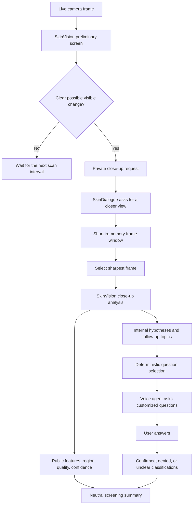

# NVIDIA-Assisted Skin Detection

CareVision includes an opt-in skin-screening workflow that combines camera
observations, a guided close-up, and the person's answers to relevant questions.
The goal is to collect better screening context and demonstrate how a companion
agent can respond intelligently to a visible change. It is not a medical
diagnosis system.

The NVIDIA vision model may return uncertain likely-condition hypotheses for
internal use. Deterministic workflow code uses the model's approved follow-up
topics to choose questions, while the hypotheses help the language agent
understand why those questions are relevant. The person's answers add symptom,
progression, exposure, and warning-sign context that could make a later review
more informative, but the combined result still does not establish a diagnosis.

## End-to-end flow

1. About once per minute, `SkinVision` analyzes an occasional whole-camera
   frame when a person is visible. When the detected face crop is at least
   64 pixels per side, the whole frame and enlarged crop are placed in the top
   and bottom panels of one labeled 1024-by-1024 in-memory JPEG. This respects
   the hosted model's one-image-per-prompt limit.
2. NVIDIA structured generation enforces strict JSON describing image quality,
   visible skin features, body region, confidence, uncertain possible
   conditions, follow-up topics, and bounded facial appearance cues.
3. If the preliminary image contains a sufficiently clear possible change, the
   result is sent privately to `SkinDialogue`.
4. The companion asks the person to show the named body area closer to the
   camera.
5. After a short positioning delay, CareVision samples frames for the configured
   close-up window and retains only the sharpest frame in memory.
6. The sharpest close-up is analyzed a second time. Only a valid close-up can
   create a public skin-change observation.
7. `SkinDialogue` uses deterministic follow-up topics to ask up to three
   customized questions. An available Gemini agent can phrase the approved
   questions naturally; reviewed templates remain available when Gemini is off.
8. Answers are classified as `confirmed`, `denied`, or `unclear` and used to
   prepare a neutral monitoring or professional-review suggestion.



Heavy network inference runs in a single-worker background executor, so the
camera capture thread does not wait for NVIDIA. Only one skin request can be in
flight at a time. Composites and individual frames are never written to disk.

## Structured NVIDIA result

Both preliminary and close-up responses must contain one JSON object matching
the stage-specific `response_format` JSON schema. Close-up responses use the
skin fields below:

```json
{
  "image_quality": "good",
  "sufficient_skin_visible": true,
  "finding_present": true,
  "visible_features": ["redness", "scaling"],
  "body_region": "left forearm",
  "confidence": 0.72,
  "possible_conditions": ["uncertain internal hypothesis"],
  "follow_up_topics": ["itching", "duration", "new_product_exposure"]
}
```

| Field | Purpose |
| --- | --- |
| `image_quality` | Must be `poor`, `fair`, or `good`. Poor images cannot produce a finding. |
| `sufficient_skin_visible` | Confirms that enough skin is visible for screening. |
| `finding_present` | Indicates that the model observed a possible visible change. |
| `visible_features` | Bounded neutral features such as redness, discoloration, swelling, scaling, blistering, dryness, bruising, irritation, lesion, or rash-like texture. |
| `body_region` | A short location such as `left forearm`, used when requesting the close-up. |
| `confidence` | Model confidence from 0 to 1, bounded again by CareVision. |
| `possible_conditions` | Up to three uncertain likely-condition hypotheses for internal context and debugging. |
| `follow_up_topics` | Approved topics that deterministic code converts into questions. |

Preliminary responses additionally require `under_eye_darkness`,
`under_eye_puffiness`, `nose_redness`, `cheek_redness`, and `lip_dryness` as
`none`, `mild`, `marked`, or `unclear`; `nasal_discharge_visible` as `no`,
`yes`, or `unclear`; and `facial_cue_confidence` from 0 to 1. These are visible
appearance observations, never tiredness, cold, allergy, or dehydration labels.
They are suppressed unless a usable face crop, fair/good image quality, and at
least 0.45 confidence are present.

CareVision rejects malformed or loose responses. A finding is accepted only
when skin is sufficiently visible, quality is not poor, confidence meets the
configured threshold, and at least one allowed visible feature is present.

## How the agent customizes questions

Question selection is controlled by `SkinDialogue`, not by unrestricted model
generation. Up to three questions are selected:

- `itching` or `pain` adds a symptom question such as, "Does the skin on your
  left forearm feel itchy or painful?"
- `duration` and `spreading` are covered by the progression question, "Is this
  new, or has it been spreading or changing quickly?"
- `fever_unwell` or `blisters` adds a warning-sign question about feeling
  feverish, feeling unwell, or severe blistering.
- If a warning-sign question is not selected, `new_medication` or
  `new_product_exposure` adds a question about a new medicine, cream, soap, or
  other product.

The uncertain condition names are included only in the agent's private prompt
context. They help it understand the relevance of an approved question; they do
not give the generative agent permission to invent a new question, select an
alert, or tell the person that they have a condition.

Answers are interpreted as:

- `confirmed`: the person confirms the symptom or change.
- `denied`: the person says the symptom or change is absent.
- `unclear`: the answer cannot be confidently classified; the workflow stops
  asking further skin questions and prepares the safest available conclusion.

The conclusion is selected from the collected classifications:

- A confirmed rapid change, feeling unwell, or relevant warning sign produces a
  prompt suggestion to consider contacting a healthcare professional.
- Confirmed symptoms without those warning signs produce a suggestion to
  monitor the area and consider professional review if it persists.
- With no confirmed symptoms, the companion suggests watching for changes.

Image analysis alone never creates an urgent caregiver alert.

## Example interaction

The internal close-up result might contain:

```text
Body region: left forearm
Visible features: redness, scaling
Possible conditions: uncertain hypotheses available internally
Follow-up topics: itching, duration, new_product_exposure
```

The person hears only the neutral workflow:

```text
Agent: I noticed a possible skin change on your left forearm. Could you show
       that area a little closer to the camera?

Agent: Does the skin on your left forearm feel itchy?
User:  Yes, it has been itchy today.

Agent: Is this new, or has it been spreading or changing quickly?
User:  It started yesterday and has not spread.

Agent: Did it start after a new medicine, cream, soap, or other product?
User:  I used a new soap this week.

Agent: Thanks for telling me. Please keep an eye on the area, and consider
       asking a healthcare professional if it persists.
```

This interaction gathers more useful context than an image alone: where the
change is, what it visibly looks like, whether it is symptomatic, how it is
progressing, and whether a relevant exposure occurred. That context can support
better screening or later professional review, but it is not a diagnosis.

## What the user sees

The normal application and LAN dashboard receive public results only. After a
valid close-up, they can show:

- The body region.
- Neutral visible features.
- Image quality and bounded confidence.
- The close-up instruction and customized questions.
- Current dialogue/answer state in the reasoning card.
- The final monitoring or professional-review suggestion.

A valid preliminary face crop can also produce a transient, non-persisted
`skin_vision.facial_appearance` signal containing only affirmative appearance
cues. The voice agent may use these cues to phrase a question only after local
PERCLOS/yawn/head-nod, sneeze/nose-touch/flushing, pallor, or lip-dryness
evidence has independently qualified. NVIDIA cues never trigger a question or
conclusion alone.

Likely-condition names are not spoken, included in normal dashboard payloads,
sent to caregiver alerts, or written to the event timeline. Before speech is
played, a filter checks for private hypothesis names, aliases, and diagnostic
phrases such as "you have" or "looks like." Unsafe generated wording is
replaced by a reviewed deterministic fallback.

## What developers can inspect

Start the localhost debug endpoint to inspect the complete live `Result`
objects, including agent-only skin context:

```powershell
python main.py --source 0 --enable-cloud-skin --listen --webui --debug-endpoint
```

Open:

- Readable debug dashboard: <http://127.0.0.1:8771/debug>
- JSON state: <http://127.0.0.1:8771/debug/state>

The debug output can include:

- `skin_vision.closeup_request`, containing the preliminary region, features,
  confidence, possible conditions, follow-up topics, and close-up duration.
- `skin_vision.analysis`, containing the validated close-up's internal likely-
  condition hypotheses and topics.
- Public `skin_vision.visible_skin_change` results.
- Confidence, quality, severity, visibility, source, location, correlation ID,
  conversation tags, TTL, and persistence policy.
- Active workflow and reasoning state.
- NVIDIA capability/consent state.
- Latest NVIDIA request state, stage, timing, sanitized error, and exact raw
  model content under `system.nvidia_skin` (in memory only).
- Gemini availability, enabled state, request counters, and error state.
- Capture, preview, analysis, and module-performance diagnostics.

The debug endpoint binds to `127.0.0.1` and is separate from the normal
dashboard. Raw image arrays, audio arrays, bytes, binary values, and data URLs
are displayed as `<redacted-media>` rather than serialized.

## Configuration

Set the API key in `.env` without adding it to command-line history:

```dotenv
NVIDIA_API_KEY=your_key_here
```

The defaults are under `modules.skin_vision` in `config/modules.yaml`:

```yaml
skin_vision:
  enabled: true
  consent: false
  endpoint: https://integrate.api.nvidia.com/v1/chat/completions
  model: meta/llama-3.2-11b-vision-instruct
  scan_interval: 60.0
  request_timeout: 25.0
  max_image_dim: 1024
  jpeg_quality: 85
  closeup_seconds: 10.0
  closeup_positioning_delay: 2.0
  min_confidence: 0.35
  min_facial_confidence: 0.45
  min_face_crop_size: 64
```

Runtime consent always comes from `--enable-cloud-skin`; the YAML `consent`
value is overwritten at startup. A configured API key alone does not schedule
an upload.

Additional built-in retry defaults are:

- Initial backoff: 15 seconds.
- Exponential multiplier: 2 after each consecutive failure.
- Maximum backoff: 900 seconds.
- One request in flight.

For a faster supervised demonstration, temporarily reduce the scan interval:

```yaml
skin_vision:
  scan_interval: 5.0
```

Restore the normal interval after testing to avoid unnecessary requests.

## Running a live demonstration

### Standard webcam

```powershell
cd C:\Users\Gabriel\Downloads\proj
python main.py --source 0 --enable-cloud-skin --listen --webui --debug-endpoint
```

### RealSense

```powershell
cd C:\Users\Gabriel\Downloads\proj
python main.py --source realsense --enable-cloud-skin --listen --webui --debug-endpoint
```

For the best demonstration:

1. Use even front lighting without strong reflections or backlighting.
2. Begin with the person and relevant body area visible in the full frame.
3. Wait for the periodic preliminary scan.
4. When prompted, bring only the named area closer and hold it steady throughout
   the close-up window.
5. Answer each question after the agent finishes speaking.

### Expected output

- **Terminal:** cloud capability status, enabled model, sanitized API failures,
  retry messages, agent utterances, and ordinary runtime diagnostics. It never
  prints the API key or encoded frame.
- **Camera/detection windows:** live video, public detections, capture/preview/
  analysis rates, and the agent's current public reasoning state.
- **Normal dashboard:** public skin feature/location/quality/confidence output,
  questions, answer state, and final suggestion. It does not include likely-
  condition names.
- **Private debug dashboard:** complete live public and agent-only results,
  including uncertain likely-condition hypotheses and approved follow-up topics.
- **Speech:** a close-up request, up to three customized questions, and a neutral
  conclusion. Diagnostic or condition-revealing generated speech is replaced.

## Failure and fallback behavior

| Situation | Behavior |
| --- | --- |
| `NVIDIA_API_KEY` missing | The cloud skin capability reports unavailable and no request is scheduled. |
| `--enable-cloud-skin` omitted | Skin cloud screening remains disabled even when the key exists. |
| Person or sufficient skin not visible | No preliminary request is scheduled or the response is rejected as not usable. |
| Poor image or confidence below threshold | No finding, hypothesis, or question workflow is created. |
| Missing/small face crop | Skin screening may continue from the whole frame, but every facial cue is suppressed. |
| Invalid structured response | The attempt is marked `invalid_response`; raw model content remains visible only in localhost diagnostics. |
| Invalid model JSON | The response is rejected and the module enters sanitized exponential backoff. |
| Timeout, rate limit, or API outage | Capture continues; the worker backs off and retries later without blocking the camera. |
| Person does not provide a close-up | The request expires and enters a short cooldown without publishing a skin finding. |
| No sharp close-up frame is collected | The close-up state resets without publishing a result. |
| Microphone unavailable | Visual screening and the close-up can still complete, but spoken answers cannot be collected; the pending dialogue expires safely. |
| Gemini unavailable or disabled | Deterministic templated questions and conclusions remain available. |

The local `rash` module remains available without NVIDIA as a coarse facial
redness/texture heuristic. While a cloud skin dialogue is active—or during its
cooldown—`SkinDialogue` suppresses the local `skin_changes` conversation topic
so the person is not asked about the same visible change twice.

## Automated verification

Run the focused contract tests without uploading any real image:

```powershell
python -m pytest -q tests\skin_vision_test.py
```

The tests use mocked network responses and cover:

- Structured response validation.
- Consent gating.
- In-memory JPEG request encoding.
- HTTP errors and timeouts.
- Preliminary and close-up result visibility.
- Customized questions and answer handling.
- Condition-name aliases and diagnostic speech filtering.
- Public versus agent-only aggregation.

## Important limitations

- The default NVIDIA model is a general vision-language model, not a validated
  dermatology device.
- Lighting, camera focus, skin visibility, motion, viewing angle, and image
  compression can change its output.
- A possible condition is an uncertain model-generated hypothesis. It can be
  incomplete, misleading, or wrong.
- User answers add valuable context but do not validate the visual hypothesis.
- The feature does not replace examination by a healthcare professional.
- CareVision deliberately reports visible observations and screening context
  rather than presenting a diagnosis.
