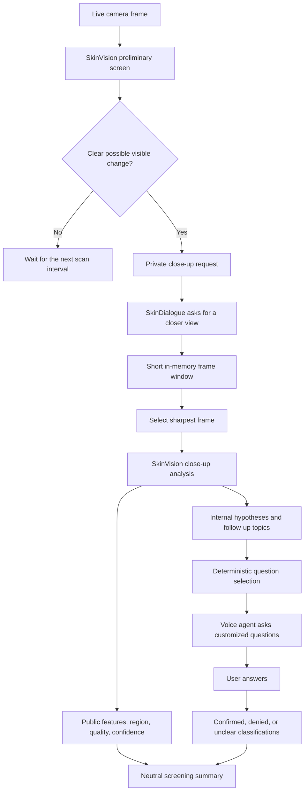

# NVIDIA-Assisted Skin Detection

This guide defines the feature's privacy, consent, and result-visibility model.
Use [OPERATIONS.md](OPERATIONS.md) for environment setup and current run modes;
the consuming code and `.env.example` remain authoritative for flags and
environment variable names.

CareVision includes an opt-in skin-screening workflow that combines camera
observations, a guided close-up, and the person's answers to relevant questions.
The goal is to collect better screening context and demonstrate how a companion
agent can respond intelligently to a visible change. It is not a medical
diagnosis system.

The NVIDIA vision model may return uncertain likely-condition hypotheses for
internal use. Deterministic workflow code uses the model's approved follow-up
topics to choose questions, while the hypotheses help the language agent
understand why those questions are relevant. The person's answers add symptom,
progression, exposure, and warning-sign context that could make a later review
more informative, but the combined result still does not establish a diagnosis.

## End-to-end flow

1. About once per minute, `SkinVision` analyzes an occasional whole-camera
   frame when a person is visible. When the detected face crop is at least
   64 pixels per side, the whole frame and enlarged crop are placed in the top
   and bottom panels of one labeled 1024-by-1024 in-memory JPEG. This respects
   the hosted model's one-image-per-prompt limit.
2. NVIDIA JSON-object mode requests parseable JSON describing image quality,
   visible skin features, body region, confidence, uncertain possible
   conditions, follow-up topics, and bounded facial appearance cues. CareVision
   enforces the complete stage schema locally and retries malformed output with
   the same neutral prompt contract.
3. If the preliminary image contains a sufficiently clear possible change, the
   result is sent privately to `SkinDialogue`.
4. The companion asks the person to show the named body area closer to the
   camera.
5. After a short positioning delay, CareVision samples frames for the configured
   close-up window and retains only the sharpest frame in memory.
6. The sharpest close-up is analyzed a second time. Only a valid close-up can
   create a public skin-change observation.
7. `SkinDialogue` uses deterministic follow-up topics to ask up to three
   customized questions. An available Moondream agent can phrase the approved
   questions naturally; reviewed templates remain available when Moondream is off.
8. Answers are classified as `confirmed`, `denied`, or `unclear` and used to
   prepare a neutral monitoring or professional-review suggestion.



Heavy network inference runs in a single-worker background executor, so the
camera capture thread does not wait for NVIDIA. A process-wide coordinator
allows only one NVIDIA request in flight and prioritizes manual arm checks,
then guided close-ups, then passive skin and scene scans. The best captured
manual frame is queued instead of discarded while another request finishes,
and new passive requests are suspended while manual work is queued or active.
Composites and individual frames are never written to disk.

## Optional local vitiligo corroboration

`SkinVision` can also load the pinned `LaurianeMD/vit-skin-disease` ViT as an
experimental, close-up-only classifier. It is not run during passive camera
screening. The same sharpest close-up selected for NVIDIA is analyzed by the
local backend after the positioning window closes, so local inference never
blocks camera capture or safety modules.

The first milestone recognizes only the model's `vitiligo` label. The private
debug analysis also retains every other Model 1 class and its score from the
same full 22-class softmax distribution. These `label_scores` are sorted from
highest to lowest, are not renormalized after excluding vitiligo, and are
explicitly marked `calibrated: false`. They are experimental model scores, not
diagnostic probabilities, and cannot affect fusion or public output. In
particular, `Unknown Normal` is never interpreted as evidence of normal skin.

Other model classes remain unsupported findings. An unknown, normal,
low-confidence, high-entropy, poor-focus, or badly exposed image causes
abstention rather than a "normal" result. The repository calibration file is
deliberately marked `validated: false`; therefore the default `debug` mode can
produce only agent-only debug evidence. Do not switch to `screening` until a
person-disjoint external evaluation has produced and reviewed a validated
calibration file.

When a calibrated local vitiligo signal agrees with an NVIDIA `discoloration`
or `pigment_loss` observation, the public wording remains neutral:
`Possible pigment change`. A cloud `pigment_loss` observation uses the same
neutral public wording without naming a condition.
The condition name stays inside the private analysis and remains subject to the
existing dashboard, persistence, alert, and speech-disclosure guards. When the
two sources disagree, the local signal does not change public output.

Two interchangeable runtimes implement the same preprocessing and abstention
contract:

- PyTorch is the full-precision reference backend for RTX A2000 development.
- TensorRT FP16 is preferred automatically on an aarch64 Jetson when a valid
  device-built engine and matching metadata are present. Failure falls back to
  PyTorch without disabling the rest of CareVision.

Install the optional development dependencies with
`pip install -r requirements-skin.txt`. Keep NVIDIA's JetPack-compatible
PyTorch package on Jetson instead of installing a generic CUDA wheel.

Provision the pinned fallback weights into the configured cache on both the
development machine and Jetson. Runtime startup is cache-only by default:

```bash
python tools/cache_skin_model.py
```

Export the pinned ONNX graph on the development machine:

```bash
python tools/export_skin_classifier.py
```

Copy the ONNX file and its `.json` metadata to the Jetson, then build the engine
on that Jetson. TensorRT engines are GPU, TensorRT, and JetPack specific and are
ignored by Git:

```bash
python tools/build_skin_tensorrt.py
```

On the Jetson, verify label-map and top-label parity, every class-probability
delta, FP16 latency, and at least 25% memory headroom using representative
close-ups:

```bash
python tools/verify_skin_backends.py data/skin-parity-images
```

For calibration, provide a CSV with `path,label,person_id,split` and optional
`skin_tone,camera,lighting,body_region` columns. Labels are `vitiligo` or
`negative`; splits are `calibration` or `test`. The tool refuses people shared
across splits and remains debug-only unless the reviewed run explicitly uses
`--approve`:

```bash
python tools/calibrate_skin_classifier.py data/skin-eval.csv
```

## Structured NVIDIA result

Both preliminary and close-up responses must contain one JSON object matching
the locally enforced stage schema. The first request uses provider JSON-object
mode; prompt-only repair attempts retain the same contract. Close-up responses
use the skin fields below:

```json
{
  "image_quality": "good",
  "sufficient_skin_visible": true,
  "finding_present": true,
  "visible_features": ["redness", "scaling"],
  "body_region": "left forearm",
  "confidence": 0.72,
  "possible_conditions": ["uncertain internal hypothesis"],
  "follow_up_topics": ["itching", "duration", "new_product_exposure"]
}
```

| Field | Purpose |
| --- | --- |
| `image_quality` | Must be `poor`, `fair`, or `good`. Poor live-skin images cannot produce a finding; a confident, evidenced displayed-photo finding remains eligible. |
| `sufficient_skin_visible` | Confirms that enough skin is visible for screening. |
| `finding_present` | Indicates that the model observed a possible visible change. |
| `visible_features` | Bounded neutral features such as redness, discoloration, pigment loss, swelling, scaling, blistering, dryness, bruising, irritation, lesion, or rash-like texture. |
| `body_region` | A short location such as `left forearm`, used when requesting the close-up. |
| `confidence` | Model confidence from 0 to 1, bounded again by CareVision. |
| `possible_conditions` | Up to three uncertain likely-condition hypotheses for internal context and debugging. |
| `follow_up_topics` | Approved topics that deterministic code converts into questions. |

Preliminary responses additionally require `under_eye_darkness`,
`under_eye_puffiness`, `nose_redness`, `cheek_redness`, `lip_dryness`,
`forehead_shine`, `eye_redness`, and `visible_skin_marking` as `none`, `mild`,
`marked`, or `unclear`; `nasal_discharge_visible` as `no`, `yes`, or `unclear`;
and `facial_cue_confidence` from 0 to 1. These are visible appearance
observations, never tiredness, cold, allergy, or dehydration labels. They are
suppressed unless a usable face crop, fair/good image quality, and at least
0.45 confidence are present.

With the nine shared skin fields above plus these eight cue enums,
`nasal_discharge_visible`, and `facial_cue_confidence`, the preliminary schema
has 20 required fields versus 9 for a close-up — the largest schema the model
is asked for. Its prompt ends with an explicit "Output shape" block
enumerating every required key and the cue enum values, mirroring the
"Feature-label guidance" block the manual arm check prompt already had. The
preliminary stage also gets its own request budget (`preliminary_max_attempts`,
`preliminary_attempt_timeout`, `preliminary_deadline`,
`preliminary_max_tokens`; see Configuration below) instead of inheriting a
smaller shared fallback.

CareVision rejects malformed or loose responses. A finding is accepted only
when skin is sufficiently visible, quality is not poor, confidence meets the
configured threshold, and at least one allowed visible feature is present.

## How the agent customizes questions

Question selection is controlled by `SkinDialogue`, not by unrestricted model
generation. Up to three questions are selected:

- `itching` or `pain` adds a symptom question such as, "Does the skin on your
  left forearm feel itchy or painful?"
- `duration` and `spreading` are covered by the progression question, "Is this
  new, or has it been spreading or changing quickly?"
- `fever_unwell` or `blisters` adds a warning-sign question about feeling
  feverish, feeling unwell, or severe blistering.
- If a warning-sign question is not selected, `new_medication` or
  `new_product_exposure` adds a question about a new medicine, cream, soap, or
  other product.

The uncertain condition names are included only in the agent's private prompt
context. They help it understand the relevance of an approved question; they do
not give the generative agent permission to invent a new question, select an
alert, or tell the person that they have a condition.

Answers are interpreted as:

- `confirmed`: the person confirms the symptom or change.
- `denied`: the person says the symptom or change is absent.
- `unclear`: the answer cannot be confidently classified; the workflow stops
  asking further skin questions and prepares the safest available conclusion.

The conclusion is selected from the collected classifications:

- A confirmed rapid change, feeling unwell, or relevant warning sign produces a
  prompt suggestion to consider contacting a healthcare professional.
- Confirmed symptoms without those warning signs produce a suggestion to
  monitor the area and consider professional review if it persists.
- With no confirmed symptoms, the companion suggests watching for changes.

Image analysis alone never creates an urgent caregiver alert.

## Example interaction

The internal close-up result might contain:

```text
Body region: left forearm
Visible features: redness, scaling
Possible conditions: uncertain hypotheses available internally
Follow-up topics: itching, duration, new_product_exposure
```

The person hears only the neutral workflow:

```text
Agent: I noticed a possible skin change on your left forearm. Could you show
       that area a little closer to the camera?

Agent: Does the skin on your left forearm feel itchy?
User:  Yes, it has been itchy today.

Agent: Is this new, or has it been spreading or changing quickly?
User:  It started yesterday and has not spread.

Agent: Did it start after a new medicine, cream, soap, or other product?
User:  I used a new soap this week.

Agent: Thanks for telling me. Please keep an eye on the area, and consider
       asking a healthcare professional if it persists.
```

This interaction gathers more useful context than an image alone: where the
change is, what it visibly looks like, whether it is symptomatic, how it is
progressing, and whether a relevant exposure occurred. That context can support
better screening or later professional review, but it is not a diagnosis.

## What the user sees

The normal application and LAN dashboard receive public results only. After a
valid close-up, they can show:

- The body region.
- Neutral visible features.
- Image quality and bounded confidence.
- The close-up instruction and customized questions.
- Current dialogue/answer state in the reasoning card.
- The final monitoring or professional-review suggestion.

A valid preliminary face crop can also produce a transient, non-persisted
`skin_vision.facial_appearance` signal containing only affirmative appearance
cues. The voice agent may use these cues to phrase a question only after local
PERCLOS/yawn/head-nod, sneeze/nose-touch/flushing, pallor, or lip-dryness
evidence has independently qualified. NVIDIA cues never trigger a question or
conclusion alone.

Likely-condition names are not spoken, included in normal dashboard payloads,
sent to caregiver alerts, or written to the event timeline. Before speech is
played, a filter checks for private hypothesis names, aliases, and diagnostic
phrases such as "you have" or "looks like." Unsafe generated wording is
replaced by a reviewed deterministic fallback.

## What developers can inspect

Start the localhost debug endpoint to inspect the complete live `Result`
objects, including agent-only skin context:

```powershell
python main.py --source 0 --enable-cloud-skin --listen --webui --debug-endpoint
```

Open:

- Readable debug dashboard: <http://127.0.0.1:8771/debug>
- JSON state: <http://127.0.0.1:8771/debug/state>

The debug output can include:

- `skin_vision.closeup_request`, containing the preliminary region, features,
  confidence, possible conditions, follow-up topics, and close-up duration.
- `skin_vision.analysis`, containing the validated close-up's internal likely-
  condition hypotheses, topics, and private local-classifier output. The local
  output includes vitiligo's targeted probability plus all non-vitiligo
  `label_scores` marked as uncalibrated experimental scores.
- Public `skin_vision.visible_skin_change` results.
- Confidence, quality, severity, visibility, source, location, correlation ID,
  conversation tags, TTL, and persistence policy.
- Active workflow and reasoning state.
- NVIDIA capability/consent state.
- Latest NVIDIA request state, queue state, stage, timing, sanitized
  HTTP/validation error, attempt history, manual completion/latency metrics,
  encoded byte count, failure categories, and backoff/circuit state.
- Moondream availability, enabled state, request counters, and error state.
- Capture, preview, analysis, and module-performance diagnostics.

The debug endpoint binds to `127.0.0.1` and is separate from the normal
dashboard. Raw image arrays, audio arrays, bytes, binary values, and data URLs
are displayed as `<redacted-media>` rather than serialized.

Provider output is never copied verbatim into debug state. Images, Base64,
prompts, credentials, and raw response envelopes are not retained. The first
attempt uses NVIDIA JSON-schema generation; retries use a compact prompt JSON
contract with the same local validation. Invalid prose, partial JSON, or a
provider failure can never create or dismiss a finding.

## Configuration

Set the API key in `.env` without adding it to command-line history:

```dotenv
NVIDIA_API_KEY=your_key_here
```

The defaults are under `modules.skin_vision` in `config/modules.yaml`:

```yaml
skin_vision:
  enabled: true
  consent: false
  endpoint: https://integrate.api.nvidia.com/v1/chat/completions
  model: meta/llama-3.2-11b-vision-instruct
  scan_interval: 60.0
  request_timeout: 25.0
  max_image_dim: 1024
  jpeg_quality: 85
  max_inline_image_bytes: 174080
  manual_max_attempts: 3
  manual_attempt_timeout: 20.0
  manual_retry_deadline: 60.0
  preliminary_max_attempts: 3
  preliminary_attempt_timeout: 25.0
  preliminary_deadline: 75.0
  preliminary_max_tokens: 520
  manual_retry_max_image_dim: 768
  manual_retry_jpeg_quality: 80
  manual_retry_max_tokens: 450
  closeup_seconds: 10.0
  closeup_positioning_delay: 2.0
  min_confidence: 0.35
  min_facial_confidence: 0.45
  min_face_crop_size: 64
```

Runtime consent always comes from `--enable-cloud-skin`; the YAML `consent`
value is overwritten at startup. A configured API key alone does not schedule
an upload.

Additional built-in retry defaults are:

- Initial backoff: 15 seconds.
- Exponential multiplier: 2 after each consecutive failure.
- Maximum backoff: 900 seconds.
- One NVIDIA request in flight across skin and scene analysis.
- Up to three provider attempts for a manual check inside a 60-second deadline
  that starts after capture; each attempt is capped at 20 seconds.
- Up to three provider attempts for a preliminary passive scan inside a
  75-second deadline; each attempt is capped at 25 seconds and requests up to
  520 tokens, escalating to 700 if the provider reports `finish_reason ==
  "length"`. A guided close-up keeps the older fallback instead: two attempts,
  a 25-second per-attempt timeout, and 700 max tokens, inside the 75-second
  deadline its caller already supplies.
- One composite is adaptively encoded through a JPEG quality/dimension ladder
  until it is no larger than 170 KiB (`174080` bytes).
- Provider-supplied HTTPS pending URLs may be polled for `202` responses, and a
  bounded `Retry-After` is honored for rate limits or temporary outages.

For a faster supervised demonstration, temporarily reduce the scan interval:

```yaml
skin_vision:
  scan_interval: 5.0
```

Restore the normal interval after testing to avoid unnecessary requests.

## Running a live demonstration

### Standard webcam

```powershell
cd C:\Users\Gabriel\Downloads\proj
python main.py --source 0 --enable-cloud-skin --listen --webui --debug-endpoint
```

### RealSense

```powershell
cd C:\Users\Gabriel\Downloads\proj
python main.py --source realsense --enable-cloud-skin --listen --webui --debug-endpoint
```

For the best demonstration:

1. Use even front lighting without strong reflections or backlighting.
2. Begin with the person and relevant body area visible in the full frame.
3. Wait for the periodic preliminary scan.
4. When prompted, bring only the named area closer and hold it steady throughout
   the close-up window.
5. Answer each question after the agent finishes speaking.

Use `--quality-profile maximum` for evaluation. Face/pose geometry remains
bounded for throughput, while local skin modules and manual arm checks derive
their ROIs from the original capture. Repeated LAB/HSV/grayscale conversions are
cached per ROI. An undersized or unstable ROI is unavailable evidence, never a
negative/clear finding.

### Expected output

- **Terminal:** cloud capability status, enabled model, sanitized API failures,
  retry messages, agent utterances, and ordinary runtime diagnostics. It never
  prints the API key or encoded frame.
- **Camera/detection windows:** live video, public detections, capture/preview/
  analysis rates, and the agent's current public reasoning state.
- **Normal dashboard:** public skin feature/location/quality/confidence output,
  questions, answer state, and final suggestion. It does not include likely-
  condition names.
- **Private debug dashboard:** complete live public and agent-only results,
  including uncertain likely-condition hypotheses and approved follow-up topics.
- **Speech:** a close-up request, up to three customized questions, and a neutral
  conclusion. Diagnostic or condition-revealing generated speech is replaced.

## Failure and fallback behavior

| Situation | Behavior |
| --- | --- |
| `NVIDIA_API_KEY` missing | The cloud skin capability reports unavailable and no request is scheduled. |
| `--enable-cloud-skin` omitted | Skin cloud screening remains disabled even when the key exists. |
| Person or sufficient skin not visible | No preliminary request is scheduled or the response is rejected as not usable. |
| Poor image or confidence below threshold | No finding, hypothesis, or question workflow is created. |
| Missing/small face crop | Skin screening may continue from the whole frame, but every facial cue is suppressed. |
| Invalid structured response | The attempt is marked `invalid_response`. Localhost diagnostics report a privacy-safe content shape (`str/prose`, `str/object`, list part counts, character count, JSON-boundary booleans) and a categorical hint such as `provider_non_json_text`, `provider_partial_json`, or `provider_json_failed_schema_validation`. They never retain raw provider content. |
| Provider answers with prose instead of JSON | A text-only follow-up re-encodes the observation into the schema (the endpoint ignores `response_format` on image calls but honors it text-only), retrying once with the prior validation error fed back as feedback. The rescued object then passes through a normalizer that drops unknown extra keys and, for the preliminary stage only, fills absent facial-cue keys with the schema's neutral values (`"unclear"`, `0.0` for `facial_cue_confidence`). It can never supply `finding_present`, `sufficient_skin_visible`, `visible_features`, `confidence`, `image_quality`, or `visual_source` — a rescue missing any of those six still fails validation — so the rescue can only produce a result less alarming than the model's own words, never more. Filled cues are `"unclear"`, which both public facial-cue paths already discard, so they reach neither speech nor the console. |
| Invalid model JSON | The response is rejected and the module enters sanitized exponential backoff. |
| Timeout, rate limit, or API outage | Capture continues; the worker backs off and retries later without blocking the camera. |
| Manual arm request waits behind another request | Its best captured frame is queued with priority over guided close-ups and passive scans; queue time counts toward the 60-second deadline. |
| Manual arm request times out or receives a retryable HTTP failure | Up to three attempts are allowed inside the 60-second total deadline. Retries use the compact prompt contract and honor bounded provider `Retry-After` guidance. The result is explicitly marked unavailable if all attempts fail; failure is never reported as clear skin. |
| Provider returns `202 Pending` | Only a provider-supplied HTTPS `Location` or `statusUrl` is polled within the same deadline; CareVision never synthesizes a polling URL. |
| Person does not provide a close-up | The request expires and enters a short cooldown without publishing a skin finding. |
| No sharp close-up frame is collected | The close-up state resets without publishing a result. |
| Microphone unavailable | Visual screening and the close-up can still complete, but spoken answers cannot be collected; the pending dialogue expires safely. |
| Moondream unavailable or disabled | Deterministic templated questions and conclusions remain available. |

Manual arm results identify their source. `local_arm_skin` is the deterministic
camera heuristic; `nvidia_vlm` is the separately completed cloud assessment.
The private debug state reports `sampling`, `pending`, `succeeded`, or
`unavailable`, plus a correlation ID and sanitized attempt metadata.
An `inference unavailable` line with HTTP 200 means transport completed but
local JSON/schema validation rejected the provider response; the appended
`hint`, content shape, object-boundary status, and finish reason distinguish
prose/refusal output, partial JSON, malformed JSON, and schema mismatches
without printing the response. The line also carries a `rescue=` field
(`skipped`, `transport_failed`, `validation_failed`, or `ok`) that
distinguishes a prose rescue that never ran from one that ran and had its
output rejected. A non-200 category instead identifies the sanitized
transport failure.

MediaPipe may print `portable_clearcut_uploader` with
`FAILED_PRECONDITION: Not valid for uploading until`. This is an internal,
nonfatal telemetry cooldown and is intentionally excluded from runtime health.
It is not globally suppressed because doing so could hide unrelated native
errors.

The local `rash` module remains available without NVIDIA as a coarse facial
redness/texture heuristic. While a cloud skin dialogue is active—or during its
cooldown—`SkinDialogue` suppresses the local `skin_changes` conversation topic
so the person is not asked about the same visible change twice.

## Arm screening

Arms get a dedicated local + cloud path at conversation distance (0.8–1.5 m):

- **Local (`arm_skin` module, offline)**: pose landmarks (shoulder/elbow/
  wrist) define oriented upper-arm/forearm ROIs. Skin is isolated by chroma
  against the person's own face skin (classic YCrCb range when no face is
  visible), enclosed discolored regions are filled back in so bruise or rash
  centers are not dropped, and — on a RealSense — a depth gate removes
  background seen past the arm. Sleeved arms are skipped automatically when
  skin covers too little of the ROI. Screens for rash-like red patchy
  clusters, bruise-like purple/dark patches (sized in cm from depth),
  dry/scaling texture, and lesion-sized dark spots (2–15 mm via depth) whose
  daily count is compared against a trailing-week baseline so tattoos and
  long-standing moles do not re-flag. LOW reliability, screening only.
- **Cloud**: when a bare arm is visible, the preliminary composite adds an
  enlarged arm-crop panel (side by side with the face crop when both
  qualify), so the vision model sees arm detail that would otherwise be a
  sliver of the whole frame. Configured by `min_arm_crop_size`.
- **Guided arm check**: press `a` or say "check my arm". The agent asks the
  person to hold a forearm up toward the camera, opens a ~12 s `arm_check`
  elicitation window, and the `arm_skin` module samples densely and speaks
  one consolidated non-diagnostic summary. With cloud consent, the sharpest
  window frame is also analyzed as a close-up, feeding the same follow-up
  question dialogue as a normal finding.

## Automated verification

Run the focused contract tests without uploading any real image:

```powershell
python -m pytest -q tests\skin_vision_test.py
```

The tests use mocked network responses and cover:

- Structured response validation.
- Consent gating.
- In-memory JPEG request encoding.
- HTTP errors and timeouts.
- Preliminary and close-up result visibility.
- Customized questions and answer handling.
- Condition-name aliases and diagnostic speech filtering.
- Public versus agent-only aggregation.

## Important limitations

- The default NVIDIA model is a general vision-language model, not a validated
  dermatology device.
- Lighting, camera focus, skin visibility, motion, viewing angle, and image
  compression can change its output.
- A possible condition is an uncertain model-generated hypothesis. It can be
  incomplete, misleading, or wrong.
- User answers add valuable context but do not validate the visual hypothesis.
- The feature does not replace examination by a healthcare professional.
- CareVision deliberately reports visible observations and screening context
  rather than presenting a diagnosis.
- The default NVIDIA API Catalog endpoint is a prototype/trial service with an
  external reliability ceiling. Retries improve transient failures but cannot
  guarantee availability; production uptime requires a supported partner or
  self-hosted endpoint.
